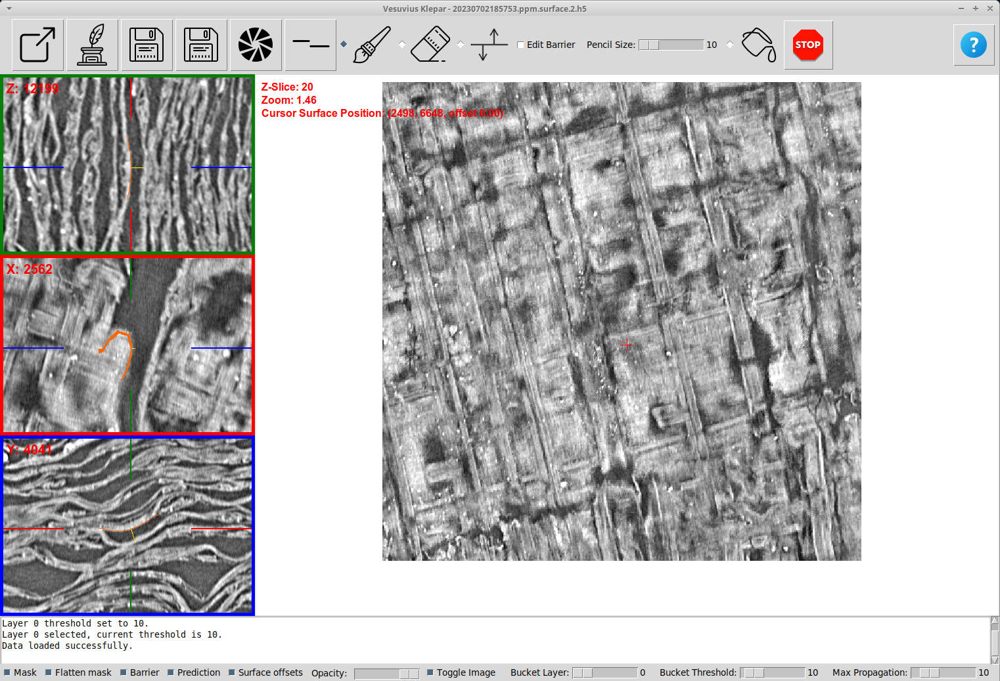
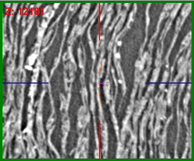

# Klepar

## Introduction

Klepar (english pronounciation `kleh-phar`) is a tool for exploring and adjusting flattened 2D surfaces for purposes of Vesuvius Challenge (https://scrollprize.org/).

It started its life as a fork of [Vesuvius Kintsugi](https://github.com/giorgioangel/vesuvius-kintsugi), whose purpose is labeling 3D voxel data extracted from the Herculaneum scrolls. This functionality still exists in this software (it was not intentionally disabled) but it is not a focus of this fork. The masks / labels themselves are however well supported in Klepar and it adds support fof previewing and saving flattened masks as TIFFs too.

An inspiration for UI came from another great software, [Khartes](https://github.com/KhartesViewer/khartes), which is a great tool for creating segments (fragments) from 3D scroll data.

The purpose of Klepar is a bit different to both of them - it aims to help explore and adjust existing surfaces. Given a surface, PPM and the original 3D scroll data, it allows browsing the surface and gaining insight about what is happening in places.

Note that when we say "surface", it could mean rendered layers or it could mean predicted pixels over the surface of segment. It is up to the user to prepare data that they want to examine. The only assumption Klepar makes about it is that its x/y coordinates (often referred to as u/v) can be looked up in the PPM file, from where the corresponding 3D coordinates are fetched, which are then used to show the correct slices of scroll data.

Klepar needs 3 inputs:
- surface
- 3D scroll data
- [PPM](https://scrollprize.org/data_segments#surface-volumes) file that matches the surface


## Installation

Install `pipenv` if not installed yet:
```
$ pip install pipenv
```

Then install all the packages:
```
$ pipenv install
```

Enter `pipenv` environment:
```
$ pipenv shell
```

Then run Klepar:
```
$ python klepar.py --help
```

## Data

### Surface

The right central part of UI shows the surface. Surface can be loaded from any source supported by Kintsugi, however the preferred approach is to load it from H5FS file using `--h5fs-file` command line parameter.

Klepar by default assumes that the order of axes in H5FS file is `xyz`. The parameter `--axes` allows specifying different axes order (e.g. `python klepar.py --axes zyx` would import data so that the first axis is `z`, the second one `y` and the last one `x`).

It is possible (and recommended for bigger surfaces) to specify region of interest using `--roi` (e.g. `--roi 1000-2000,2000-3000,0-41`). Regardless of `--axes` parameter the coordinates are always specified in `xyz` order.

Parameter `--stride` tells us that the surface was generated using stride (for example, if only every 4-th pixel in x/y axis was used, use `--stride=4`). This parameter does not affect surface z-axis.

### Scroll data

For performance reasons, scroll data needs to be converted to H5FS file. H5 files are nice to use because they do not fill empty data when creating the dataset, only when the data is written to it. This allows us to download only the parts that we are interested in. The dataset can be constructed like this:
```py
    f = h5py.File(h5_filename, 'a')
    shape = (SLICE_HEIGHT, SLICE_WIDTH, AVAILABLE_SLICES)  # hdf5 doesn't fill empty space
    dset = f.require_dataset("scroll1", shape=shape, dtype=np.uint16, chunks=(250, 250, 250))
```

It can be filled either from TIFF slices or `volume_grids/` data (whatever you have already downloaded), but be careful about axes order (`yxz`).

### PPM

PPM translates every pixel in surface image into 3 coordinates (x, y, z) and the 3 normal vector coordinates. Klepar uses it to load the three 3D images for the selected point on surface. To specify the PPM file, use `--ppm` command line argument.

## Example usage

Command line looks long, but it is easy to put it into a shell script, for example run.sh:

```
#!/bin/bash
python klepar.py --h5fs-file /path/to/surface.h5 --axes=xyz --roi=2000-3000,6000-7000,0-41 --stride=2 --h5fs-scroll /path/to/scroll.h5 --ppm /from/dl.ash2txt.org/full-scrolls/Scroll1.volpkg/paths/20230702185753/20230702185753.ppm
```

## UI



Moving the surface (drag with left mouse button) will automatically update the 3D view in the left.

The 3D panel on the left shows `z`, `x` and `y` view. It is not possible to move the views in the left panel, because that would often put the 3D coordinates outside of the examined surface.



3D views show:
- any pixels that are in the vicinity of the selected pixel (orange)
- normal vector as seen in this dimension (yellow)
- z-index location along the normal vector (purple)

When using mouse scroll to change the z-index on surface view, purple line shows us how far above / below the surface we are in 3D view.

## Adjusting the surface

To adjust the surface we can put the nodes on surface in different z-index levels. Once we are satisfied, we can press `Update Surface Adjuster Offsets` button, which will start generating the image corresponding to our nodes. The algorithm is simple - the area between the nodes (as seen on surface x/y plane) is triangulated. The offset is then calculated for each triangle. To see the offsets, make sure that `Surface offsets` checkbox at the bottom of the screen is checked.

The nodes are saved in JSON format to the file specified using `--surface-adjust-file` whenever the surface offsets are generated. If not file is specified then a random file name in temporary directory (usually `/tmp/` on Linux) will be used.

